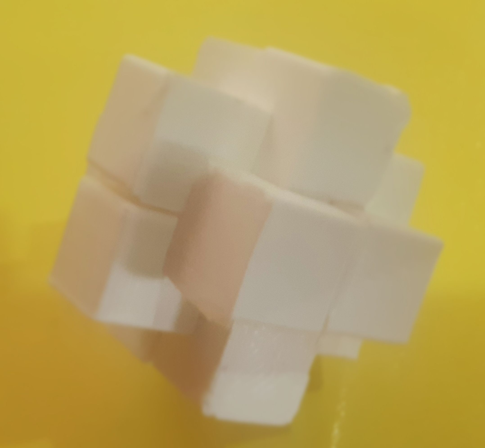
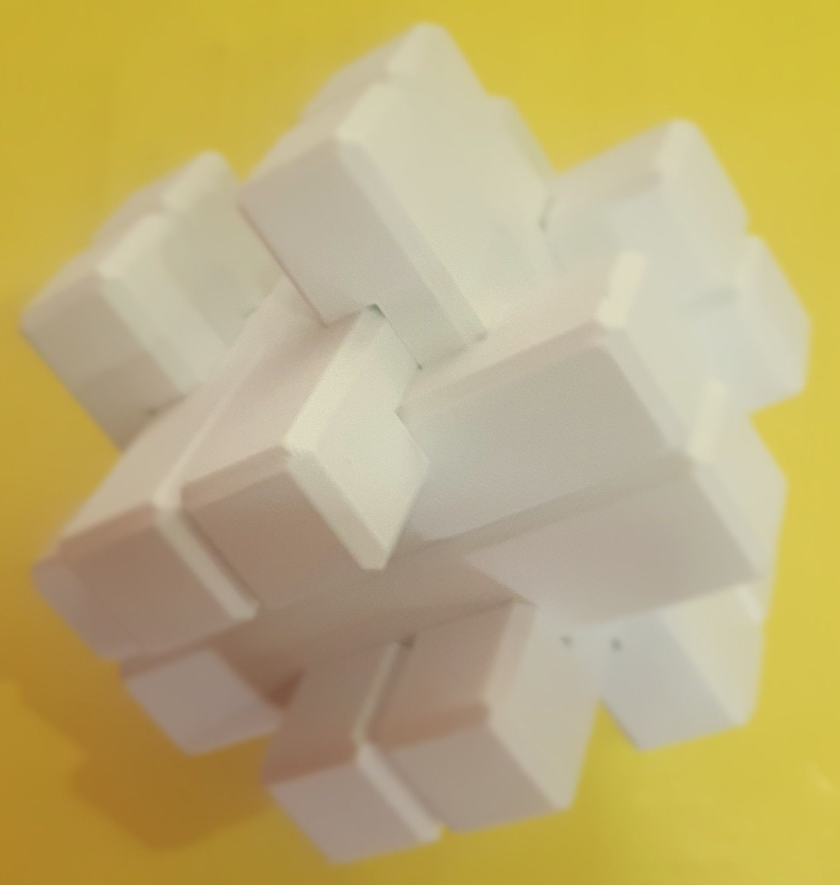

# Casses-têtes
Répertoire de plusieurs casse-têtes réalisés en impression 3D, sous licence
Apache 2.0.

## Cube
Créé à partir d'un modèle du commerce réalisé en bois. Un ensemble de pièces
peuvent former un cube plein quand elles sont correctement agencées.

* [Cube - Source OpenSCAD](cube.scad) ;
* [Cube - Fichier STL](cube.stl).

## Lock 6
Assemblage de 6 pièces.

* [Lock 6 - Source OpenSCAD](lock-6.scad) ;
* [Lock 6 - STL](lock-6.stl).

## Lock 12
Un assemblage de 12 pièces qui semblent se bloquer toutes.

* [Lock 12 - Source OpenSCAD](lock-12.scad) ;
* [Lock 12 - STL](lock-12.stl).

